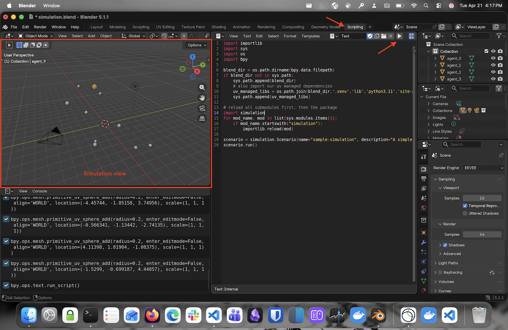
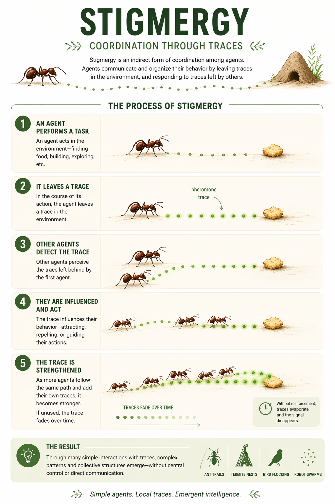

# Stigmergy Simulation
The goal of this repository is to create a simulation of stigmergy, a mechanism by which simple agents interact with their environment to produce complex behaviors. The python code runs inside of [Blender](https://www.blender.org/) allowing us to see the emergent behaviors of the agents as they interact with their environment.

## Table of Contents
- [Requirements](#requirements)
- [Installation](#installation)
- [Repository structure](#repository-structure)
- [Running the simulation](#running-the-simulation)
- [Stigmergy Explained](#stigmergy-explained)

## Requirements
- Python: https://www.python.org
- Blender: https://www.blender.org/download/
- UV package manager: https://docs.astral.sh/uv
- GIT: https://git-scm.com

## Installation
1. Clone the repository
2. Install the dependencies using UV
3. Open Blender and run the simulation from the scripts menu.

> [!IMPORTANT]
Blender has its own python environment, but we import the UV managed libs in the main script, so you can use UV to manage your dependencies and they will be available in Blender.

## Repository structure
- `simulation/`: Contains the main simulation code and scenarios.
- `simulation.blend`: A Blender file that contains the simulation setup and can be used to run the simulation.

The only python code that exists in Blender, is the one required to load the contents of the `simulation/` directory. This allows us to keep the simulation code separate from the Blender file, making it easier to edit and maintain.

```python
import importlib
import sys
import os
import bpy

blend_dir = os.path.dirname(bpy.data.filepath)
if blend_dir not in sys.path:
    sys.path.append(blend_dir)
    # also import our uv managed dependencies
    uv_managed_libs = os.path.join(blend_dir,'.venv','lib','python3.11','site-packages')
    sys.path.append(uv_managed_libs)

# reload all submodules first, then the package
import simulation
for mod_name, mod in list(sys.modules.items()):
    if mod_name.startswith("simulation"):
        importlib.reload(mod)

scenario = simulation.Scenario(name="sample-simulation", description="A simple simulation")
scenario.run()
```

## Running the simulation
Open our `simulation.blend` file in Blender, then click the play button from the `scripts` menu.



## Stigmergy Explained

